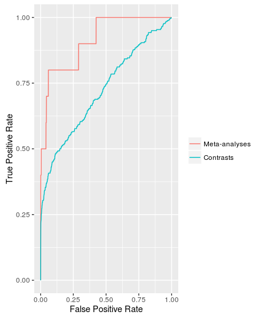

<!--
%\VignetteEngine{knitr::rmarkdown}
%\VignetteIndexEntry{ccmap vignette}
-->


`ccmap` finds drugs and drug combinations that are predicted to reverse or
mimic gene expression signatures. These drugs might reverse diseases or mimic 
healthy lifestyles.

-----------------

###Query Signatures

To obtain a query gene expression signature, it is reccommended that you perform a 
meta-analysis of all gene expression studies that have compared similar groups.
This can be accomplished with the [**crossmeta**](https://github.com/alexvpickering/crossmeta) package.

This meta-analysis approach was validated by querying the cmap drug signatures 
using independant drug expression data. Query signatures from meta-analyses have 
improved rankings of the selfsame cmap drugs (figure 1).




Figure 1. Receiver operating curves comparing query results using 
signatures from individual contrasts (auc = 0.720) to meta-analyses (auc = 0.913).
Queries from signatures generated by meta-analyses for 10 drugs were compared to
queries from the 260 contrasts used in the meta-analyses.

<br>

To use `ccmap`, the query signature needs to be a named vector of effect size 
values where the names correspond to uppercase HGNC symbols. If you used 
`crossmeta`, proceeed as follows:


```{r, message=FALSE, warning=FALSE}
library(crossmeta)
library(ccmap)

# microarray data from studies using drug LY-294002
library(lydata)
data_dir <- system.file("extdata", package = "lydata")

# gather all GSEs
gse_names  <- c("GSE9601", "GSE15069", "GSE50841", "GSE34817", "GSE29689")

# load previous crossmeta differential expression analysis
anals <- load_diff(gse_names, data_dir)

# run meta-analysis
es <- es_meta(anals)

# contribute your signature to our public meta-analysis database
# contribute(anals, subject = "LY-294002")

# extract moderated adjusted standardized effect sizes
dprimes <- get_dprimes(es)

# query signature
query_sig <- dprimes$meta
```

-----------------

###Drug Signatures

CMAP drug signatures were generated using the raw data from the [Connectivity Map
build 2](https://www.broadinstitute.org/cmap/). The raw data from experiments with
a shared platform were norm-exp background corrected, quantile normalized, and 
log2 transformed (RMA algorithm). After preprocessing, contrasts were specified
such that all signatures for each drug were compared to all vehicle treated signatures.
Non-treatment related variables (cell-line, drug dose, batch effects, etc.)
were discovered using `sva` and accounted for during differential expression
analysis by `limma`. Finally, moderated t-statistics calculated by `limma` were 
used by `GeneMeta` to calculate moderated unbiased standardised effect sizes.

The final drug signatures are available in the `ccdata` package.

```{r, message=FALSE, warning=FALSE}
library(ccdata)

# load drug signatures
data(cmap_es)
```

LINCS l1000 signatures (drugs and genetic under/over expression) were generated using the raw level 1 lxb files. For each cell line, all vehicle wells were quantile normalized. These were used as reference distributions in order to quantile normalize all treatment wells for the corresponding cell line. For deconvolution of each probe pair in each well, four gaussian mixtures models were fitted to the normalized and log2 transformed data: **1)** `Mclust` with equal variance, **2)** `Mclust` with equal variance and outliers initialized by `spoutlier`, **3/4)** a modified `mixtools` model excluding outliers determined from (2) and biased towards the predominant peak lying at either lower (3) or higher (4) expression values. `xgboost` was used to choose one of these four models using a manually labeled sample as training data. In order to correct flipped peaks, another round of manual labeling was performed with summaries displayed from the first round for the same cell/treatment. As for CMAP drug signatures above, surrogate variable were accounted for and moderated unbiased standardised effect sizes were calculted.

The final drug signatures are available in the `ccdata` package.

```{r, message=FALSE, warning=FALSE}
# load drug signatures
data(l1000_es)
```

-----------------

###Querying Drug Signatures

Cosine similarity is calculated between the query and drug signatures.

```{r, message=FALSE, warning=FALSE}
top_cmap  <- query_drugs(query_sig, 'cmap')
top_l1000 <- query_drugs(query_sig, l1000_es)

# LY-294002 best match among 1309 cmap signatures
# other PI3K inhibitors are also identified among top matching drugs
head(top_cmap, 4)

# LY-294002 matches 4 of top 10 l1000 signatures (230,829 total) 
# other PI3K inhibitors are also identified among top matching drugs
head(top_l1000, 4)
```

Note that only a subset of the cmap genes were measured in the l1000 signatures. As such, only common genes should be included if you wish to directly compare cmap and l1000 queries. To do this:

```{r, message=FALSE, warning=FALSE}
# remove genes in cmap_es that are not measured in l1000_es
data(cmap_es)
cmap_lm <- cmap_es[row.names(l1000_es), ]

# query using genes common to cmap_es and l1000_es
top_cmap  <- query_drugs(query_sig, cmap_lm)
top_l1000 <- query_drugs(query_sig, l1000_es)
```

-----------------

###Drug Combinations


To more closely mimic or reverse a gene expression signature, drug combinations
may be promising. For the 1309 drugs in the Connectivity Map build 2, there are 
856086 unique two-drug combinations. It is currently unfeasable to assay all these
combinations, but their expression profiles can be predicted.

In order to do so, I collected microarray data from GEO where single treatments
and their combinations were assayed. In total, 148 studies with 257 treatment 
combinations were obtained.

Remarkably, simply averaging the expression profiles from the single treatments
predicted the direction of differential expression of the combined treatment 
with 78.96% accuracy. The average expression profiles for all 856086 unique two-drug cmap combinations can be generated and queried as follows:

```{r, message=FALSE, warning=FALSE}
# query all 856086 combinations (takes ~10 minutes on Intel Core i7-6700)
# top_combos <- query_combos(query_sig, cmap_es)

# query only combinations with LY-294002
top_combos <- query_combos(query_sig, cmap_es, include='LY-294002', ncores=1)
```

Combinations of l1000 signatures can also be queried using the average method. As ~26 billion two-perturbagen combinations are possible, queries should be limited to combinations with the top few perturbagens. For example:

```{r, message=FALSE, warning=FALSE}

# query only combinations with LY-294002
top_combos <- query_combos(query_sig, l1000_es, include='LY-294002', ncores=1)
```


A small improvement to 80.18% acurracy was obtained using machine learning models.
To use these models requires 8-10GB of RAM and about 2 hours (Intel Core i7-6700 with the [MRO+MKL](https://mran.revolutionanalytics.com/open/) distribution of R) to predict and query all 856086 unique two-drug cmap combinations. In practice, the drug combinations that most closely mimic or reverse a query signature usually include the top few single drugs. By only predicting drug combinations that include the top few single drugs, prediction times are greatly reduced:

```{r, message=FALSE, warning=FALSE}
# Times on Intel Core i7-6700 with MRO+MKL
# requires ~8-10GB of RAM

method  <- 'ml'
include <- names(head(top_cmap))

# query all 856086 combinations (~2 hours)
# top_combos <- query_combos(query_sig, cmap_es, method)

# query combinations with top single drugs (~1 minute)
# top_combos <- query_combos(query_sig, cmap_es, method, include)

sessionInfo()
```
