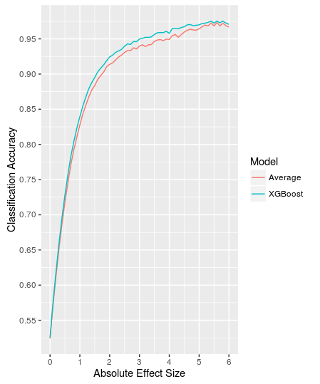

<!--
%\VignetteEngine{knitr::rmarkdown}
%\VignetteIndexEntry{ccmap vignette}
-->


`ccmap` finds drugs and drug combinations that are predicted to reverse or
mimic gene expression signatures. These drugs might reverse diseases or mimic 
healthy lifestyles.

-----------------

###Query Signatures

To obtain a query gene expression signature, it is reccommended that you perform a 
meta-analysis of all gene expression studies that have compared similar groups.
This can be accomplished with the [**crossmeta**](https://github.com/alexvpickering/crossmeta) package.

This meta-analysis approach was validated by querying the cmap drug signatures 
using independant drug expression data. Query signatures from meta-analyses have 
improved rankings of the selfsame cmap drugs (figure 1).


Figure 1. Receiver operating curves comparing query results using 
signatures from individual contrasts (auc = 0.720) to meta-analyses (auc = 0.913).
Queries from signatures generated by meta-analyses for 10 drugs were compared to
queries from the 260 contrasts used in the meta-analyses.

<br>

To use `ccmap`, the query signature needs to be a named vector of effect size 
values where the names correspond to uppercase HGNC symbols. If you used 
`crossmeta`, proceeed as follows:


```{r, message=FALSE, warning=FALSE}
library(crossmeta)
library(ccmap)

# microarray data from studies using drug LY-294002
library(lydata)
data_dir <- system.file("extdata", package = "lydata")

# gather all GSEs
gse_names  <- c("GSE9601", "GSE15069", "GSE50841", "GSE34817", "GSE29689")

# load previous crossmeta differential expression analysis
anals <- load_diff(gse_names, data_dir)

# run meta-analysis
es <- es_meta(anals)

# contribute your signature to our public meta-analysis database
# contribute(anals, subject = "LY-294002")

# extract moderated adjusted standardized effect sizes
dprimes <- get_dprimes(es)

# query signature
query_sig <- dprimes$meta
```

-----------------

###Drug Signatures

Drug signatures were generated using the raw data from the [Connectivity Map
build 2](https://www.broadinstitute.org/cmap/). The raw data from experiments with
a shared platform were norm-exp background corrected, quantile normalized, and 
log2 transformed (RMA algorithm). After preprocessing, contrasts were specified
such that all signatures for each drug were compared to all vehicle treated signatures.
Non-treatment related variables (cell-line, drug dose, batch effects, etc.)
were discovered using `sva` and accounted for during differential expression
analysis by `limma`. Finally, moderated t-statistics calculated by `limma` were 
used by `GeneMeta` to calculate moderated unbiased standardised effect sizes.

The final drug signatures are available in the `ccdata` package.

```{r, message=FALSE, warning=FALSE}
library(ccdata)

# load drug signatures
data(cmap_es)
```

-----------------

###Querying Drug Signatures

Genes from query and drug signatures are ranked based on their absolute effect
sizes and then classified as up or down regulated based on the sign of their 
effect sizes. Net overlap (z), defined as the difference between the number of
genes regulated in the same and opposite directions, is then calculated as a
function of drug and query gene ranks (x and y). The volume under the surface 
(vos) formed by plotting z as a function of x and y is used for the final drug 
rankings. This vos metric has the advantage of weighting both query and drug 
genes according to their extent of differential expression. 

```{r, message=FALSE, warning=FALSE}
library(ccmap)
top_drugs <- query_drugs(query_sig)

# correctly identifies LY-294002 as best match among drug signatures
# other PI3K inhibitors are also identified among top matching drugs
head(top_drugs)
```

-----------------

###Drug Combinations


To more closely mimic or reverse a gene expression signature, drug combinations
may be promising. For the 1309 drugs in the Connectivity Map build 2, there are 
856086 unique two-drug combinations. It is currently unfeasable to assay all these
combinations, but their expression profiles can be predicted using machine 
learning methods.

In order to do so, a gradient boosted random forest was trained using microarray
data from GEO where single treatments and their combinations were assayed. In total,
96 studies with 163 treatment combinations and almost 7.5 million features were 
used for training. The final model is most accurate for transcripts with higher 
absolute standardized effect sizes (figure 2). The model's overall 
classification accuracy is 76.64% (assessed on out-of-fold data). This is a 
slight improvement over some simple benchmark models. For example, predicting 
that the combination treatment effect is an average of the two treatments is 
76.19% accurate. 



Figure 2. Transcripts with higher absolute standardized effect sizes for 
treatment combinations are classified more accurately. A gradient boosted random
forest model in comparison to a a benchmark model where single treatments are
averaged. For reference, about 40% of the data had an absolute effect size 
greater than 1.

<br>

Predicting all 856086 drug combination signatures would require substantial 
computing time (about 2.5 days using a Intel Core i7-6700K) and 107GB of memory.
In practice, the drug combinations that most closely mimic or reverse a query 
signature usually include the top few single drugs. By only predicting drug 
combinations that include the top few single drugs, memory requirements and 
prediction times are greatly reduced:

```{r eval=FALSE}
library(ccmap)
# this takes ~6 minutes per drug in 'with'
drug_combos <- predict_combos(with = c("LY-294002", "dilazep"))

# query drug combination signatures using a range of query gene sizes
range_res <- query_drugs(query_sig, drug_combos)
```
```{r}
sessionInfo()
```
